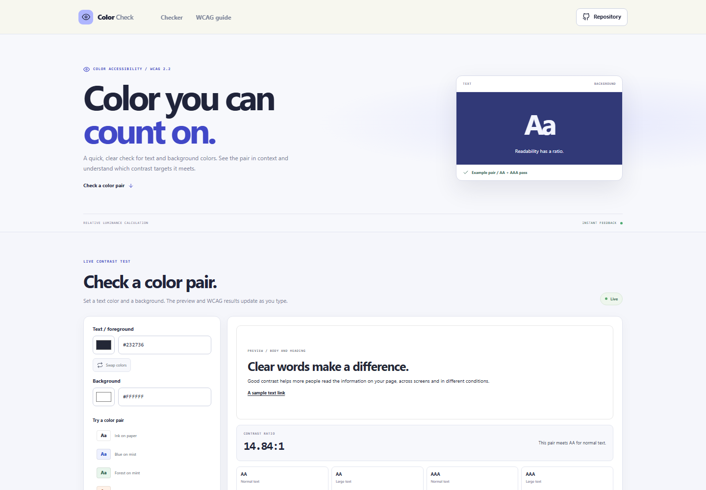



# Color Contrast Checker

Test a foreground and background color pair against WCAG text contrast targets. Edit a hex value or use the native color picker, watch the preview update, and see AA and AAA results as you work.

**Live app:** [https://a2rp.github.io/color-contrast-checker/](https://a2rp.github.io/color-contrast-checker/)

## What you can do

- Choose text and background colors with the browser color picker or enter 3 or 6 digit hex values.
- Preview a heading, body paragraph, and link using the selected pair.
- See the contrast ratio update immediately when both colors are valid.
- Swap foreground and background colors with one action.
- Try four example color pairs.
- Check WCAG AA and AAA results for normal and large text.
- Use the tool on desktop or mobile. Calculations run in the browser.

## How the score works

The checker converts each sRGB color to relative luminance, then applies the WCAG contrast ratio formula. Results range from 1:1 to 21:1. The tool reports these text targets:

- AA normal text: 4.5:1
- AA large text: 3:1
- AAA normal text: 7:1
- AAA large text: 4.5:1

Large text means at least 18pt regular or 14pt bold. A passing color ratio is one part of accessible design and does not check every accessibility requirement.

## Privacy and limits

The app calculates colors locally and does not upload or save color choices. Enter 3 or 6 digit hex colors without alpha transparency. Invalid values are identified and pause the ratio calculation until corrected.

## Run locally

Requires Node.js and npm.

```sh
npm install
npm run dev
```

Run the tests, check the code with ESLint, and create a production build:

```sh
npm test
npm run lint
npm run build
```

Publish the production build to GitHub Pages with:

```sh
npm run deploy
```

## Future improvements

These are ideas for later versions and are not implemented yet:

- Add color sampling from an image.
- Add color-blindness preview modes.
- Add suggestions for adjusting a failing color pair.

## Links

- Portfolio: [https://www.ashishranjan.net](https://www.ashishranjan.net)
- GitHub: [https://github.com/a2rp](https://github.com/a2rp)
- CodePen: [https://codepen.io/ash1198](https://codepen.io/ash1198)
- LinkedIn: [https://www.linkedin.com/in/aashishranjan](https://www.linkedin.com/in/aashishranjan)
- Facebook: [https://www.facebook.com/theash.ashish/](https://www.facebook.com/theash.ashish/)
- YouTube: [https://www.youtube.com/@ashishranjan-ashz?sub_confirmation=1](https://www.youtube.com/@ashishranjan-ashz?sub_confirmation=1)
- Email: [mailto:ash.ranjan09@gmail.com](mailto:ash.ranjan09@gmail.com)

## Support

- Support: [https://a2rp-donation-page.netlify.app/](https://a2rp-donation-page.netlify.app/)
- Buy Me a Coffee: [https://buymeacoffee.com/ashishranjan](https://buymeacoffee.com/ashishranjan)
- Patreon: [https://www.patreon.com/ashishranjan](https://www.patreon.com/ashishranjan)
